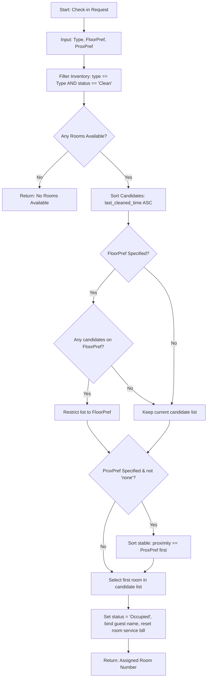
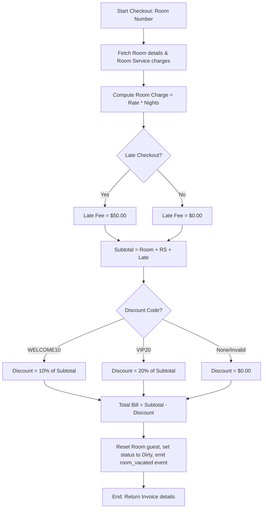
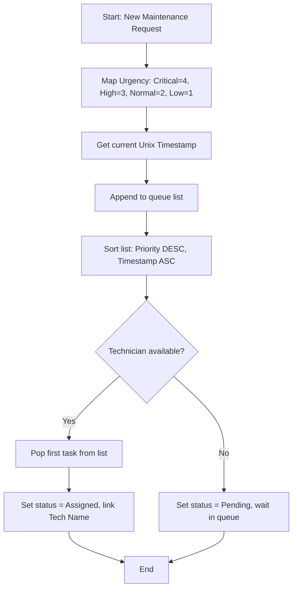

# GRANDSTAY HOTELOS
## Real-Time Hotel Management System
**Unit 4: Programming | H/618/7388 | Level 4 | 15 Credits**

**Author:** Raximkulov Nurbek  
**Student ID:** Student_BTEC_9999  
**Assessor:** BTEC Assessor  
**Submission Date:** June 2, 2026  

---

## Table of Contents
1. [Task 1 — Algorithms and the Code Process](#task-1--algorithms-and-the-code-process)
   - 1.1 Room Assignment Algorithm
   - 1.2 Supporting Algorithms
   - 1.3 Journey from Code to Execution in Python
   - 1.4 Technology Stack Justification
2. [Task 2 — Programming Paradigms in HotelOS](#task-2--programming-paradigms-in-hotel-os)
   - 2.1 The Three Paradigms Explained
   - 2.2 Procedural Programming in HotelOS
   - 2.3 Object-Oriented Programming in HotelOS
   - 2.4 Event-Driven Programming in HotelOS
   - 2.5 Key IDE Components Used
3. [Task 3 — Building HotelOS](#task-3--building-hotelos)
   - 3.1 Architectural Overview
   - 3.2 Security Considerations
   - 3.3 IDE Development Process Evidence
   - 3.4 Test Scenario Results
4. [Task 4 — Debugging and Coding Standards](#task-4--debugging-and-coding-standards)
   - 4.1 The Debugging Process
   - 4.2 Debugging Log
   - 4.3 Debugging for Security
   - 4.4 Nurbek's Coding Standard
   - 4.5 Coding Standards in Professional Teams
5. [References](#references)

---

## Task 1 — Algorithms and the Code Process

### 1.1 Room Assignment Algorithm

The Room Assignment Algorithm is the operational foundation of HotelOS. When a guest requests a room at check-in, the system must automatically and atomically identify the single best room from the current active inventory.

#### Written Step-by-Step Description
1. **Inputs**: The algorithm accepts:
   - `requested_type`: The desired room category (Single, Double, Suite, Accessible).
   - `floor_preference`: An optional integer representing the desired floor (1 to 2).
   - `proximity_preference`: An optional string representing preferred layout position (`"elevator"`, `"stairs"`, or `"none"`).
2. **Filtering by Type and Status**: Iterate through the room inventory. Retain only those rooms where:
   - `room_type` matches `requested_type` exactly.
   - `status` is `"Clean"` exactly. Rooms with status `"Dirty"`, `"Being cleaned"`, or `"Maintenance"` are filtered out.
3. **Availability Check**: If the list of candidate rooms is empty after filtering, immediately terminate the algorithm and return `None` (representing a "no rooms available" state).
4. **Primary Sort - Longest Clean**: To distribute wear and tear evenly, sort the candidates by the time they have spent in the `"Clean"` state. Calculate this by sorting the rooms in ascending order of their `last_cleaned_time` (unix timestamp). Since the timestamp represents the moment the room was marked clean, a smaller/older timestamp indicates the room has been clean the longest.
5. **Secondary Filter - Floor Preference**: If `floor_preference` is provided by the guest:
   - Check if any candidates in the sorted list reside on `floor_preference`.
   - If one or more match, filter the candidate list to include *only* those on the requested floor (retaining the longest clean sort order).
   - If no candidates match the floor preference, ignore the preference and proceed with the full sorted candidate list (fallback mechanism).
6. **Final Tiebreaker - Proximity Preference**: If `proximity_preference` is provided and is not `"none"`:
   - Re-sort the candidate list so that rooms where `proximity` matches `proximity_preference` are placed first. This sort must be stable, preserving the relative "longest clean" order of the rooms.
7. **Assignment & Atomicity**: Select the first room in the final candidate list. Set its status to `"Occupied"`, record the guest's details (`guest_name`, `nights`), and reset its accumulated room service charges to zero. Return the room number.

#### Flowchart Representation


*Figure 1: Room Assignment Algorithm Flowchart.*

#### Design Justification and Alternatives Considered
This algorithm was designed with a filtering pipeline followed by stable sorting passes to ensure it strictly respects the priority hierarchy requested.
- **Alternative 1: Scoring Matrix**: I considered assigning a numeric weight to each criterion (e.g., room type match = 100 points, longest clean = 50 points, floor match = 10 points) and selecting the room with the highest score. While elegant, a scoring matrix runs the risk of a room on the wrong floor outscoring a room on the correct floor because it was clean longer. The rigid hierarchical filter-and-sort approach guarantees that room type and cleanliness remain non-negotiable hard constraints, while preferences act as secondary qualifiers.
- **Alternative 2: Database Ordering**: I rejected offloading the logic to database queries (e.g. `ORDER BY last_cleaned_time`) because microservices hold isolated data. Keeping the logic inside the service class using in-memory filters ensures the Reception Service can operate on its internal list structure under a local memory lock, preventing race conditions.

---

### 1.2 Identify and Design Supporting Algorithms

#### 1. Billing Calculation Algorithm
On checkout, the system must calculate the total bill for the guest.

##### Step-by-Step Description
1. **Inputs**: Room number, late checkout flag (boolean), discount code (string).
2. **Room Details Retrieval**: Query the room inventory. If the room is not occupied, throw an error. Retrieve the room's `nightly_rate`, `nights` stayed, and `room_service_charges` (accumulated via events).
3. **Base Accommodation Calculation**: Multiply `nightly_rate` by `nights` to compute `room_charges`.
4. **Additional Fees**: If the late checkout flag is `True`, add a flat late fee of `$50.00`. If any other operational fees exist, sum them.
5. **Subtotal Summation**: Add `room_charges`, `room_service_charges`, and late checkout fees to get `subtotal`.
6. **Discount Codes Application**: Check the `discount_code`:
   - If `"WELCOME10"`, calculate `discount_applied = subtotal * 0.10`.
   - If `"VIP20"`, calculate `discount_applied = subtotal * 0.20`.
   - Otherwise, `discount_applied = 0.00`.
7. **Final Balance**: Subtract `discount_applied` from `subtotal` to compute `total_bill`. Ensure `total_bill` is not negative.
8. **State Transition**: Reset the room's guest details, room service billing, and change its status to `"Dirty"`. Publish a `"room_vacated"` event to the message broker.


*Figure 2: Billing Calculation Algorithm Flowchart.*

#### 2. Priority Queue Algorithm for Maintenance
Ranks incoming maintenance requests by urgency and submits them to technicians.

##### Step-by-Step Description
1. **Inputs**: Maintenance issue containing `room_number`, `description`, and `urgency` (`Critical`, `High`, `Normal`, `Low`).
2. **Priority Score Mapping**: Assign a numeric priority score to the urgency level:
   - `Critical` = 4
   - `High` = 3
   - `Normal` = 2
   - `Low` = 1
3. **Queue Insertion**: Package the issue into a dictionary including its generated `issue_id`, `priority_score`, and `created_at` timestamp (unix format). Append it to the maintenance queue.
4. **Sort Priority Queue**: Sort the queue using a double-key comparison:
   - Primary Key: `priority_score` in descending order (highest score first).
   - Secondary Key: `created_at` in ascending order (earliest timestamp first).
5. **technician Assignment**: When a technician becomes available, dequeue the first element of the sorted queue (the highest priority, oldest request). Change its status to `"Assigned"` and log the technician's name.


*Figure 3: Priority Queue Algorithm Flowchart.*

---

### 1.3 Journey from Code to Execution in Python

Python is an interpreted, bytecode-compiled, and dynamic language. Unlike static languages like C++ or Java, Python uses the CPython runtime to process code. The journey of our HotelOS code (e.g. `reception/main.py`) proceeds through the following stages:

#### 1. Pre-processing
Python does not use a standalone pre-processor like C/C++ (`#include` or `#define`). Instead, when uvicorn starts the server, the interpreter scans the file. During this step, the source code is parsed into an **Abstract Syntax Tree (AST)**. Lexical analysis divides the source strings into tokens, and syntax checks ensure the code adheres to Python's structural rules. Any syntax error (e.g., mismatched brackets or incorrect indentation) is caught at this stage, preventing execution.

#### 2. Compilation (Bytecode generation)
The AST is compiled into a lower-level, platform-independent representation called **bytecode** (represented by `.pyc` files stored in a `__pycache__` directory). For example, `reception/main.py` is compiled into bytecode instructions. The compiler performs static analysis, optimizing basic constants.
Errors caught at this stage include invalid syntax, import warnings, and incorrect string formatting.

#### 3. Linking
Python uses **dynamic linking and resolving**. There is no static link stage. When `reception/main.py` encounters `from shared.models import RoomStatus`, the interpreter searches `sys.path`. It dynamically loads and runs the module, binding names into the local namespace. If the module is not found, a `ModuleNotFoundError` is raised at runtime when the execution hits that line.

#### 4. Execution
The compiled bytecode is fed into the **CPython Virtual Machine**, which runs an execution loop. The virtual machine executes bytecode instructions using a stack. 
- **Memory Management**: Memory is managed via a private heap. Python objects (e.g. our `rooms` list) are allocated on this heap. CPython uses **reference counting** as its primary memory management mechanism. When reference count drops to 0, memory is immediately freed. A cyclic garbage collector periodically sweeps for reference cycles.
- **Concurrency**: Python uses the **Global Interpreter Lock (GIL)**. To achieve concurrency across our services without blocks, we leverage `asyncio`, running cooperative multitasking on a single thread. When reception waits for network packets, it yields control (`await`), allowing other routines to run.

---

### 1.4 Technology Stack Justification

| Technology | Selected Tool | Technical Justification | Limitations | Mitigation Plan |
| :--- | :--- | :--- | :--- | :--- |
| **Language** | Python 3.10+ | Fast development cycle, robust standard library, excellent built-in async features. | CPU bound due to GIL. | Utilize asynchronous I/O (`asyncio`) and deploy services as separate OS processes. |
| **Framework** | FastAPI | High performance, automatic OpenAPI documentation, Pydantic input validation out-of-the-box. | Requires a running ASGI server (Uvicorn) to execute. | Bundled with Uvicorn, configured via a single test script. |
| **Message Broker**| Custom WS Broker | Lightweight, zero external system dependencies (runs anywhere without RabbitMQ/Redis installation). | Lacks persistent queues or disk backups. | Rely on robust WebSocket retry handlers and in-memory fallback databases. |
| **WebSocket** | Websockets / FastAPI | Direct support inside FastAPI, fast communication, handles hundreds of persistent connections. | Connections can drop on network hiccups. | Implement heartbeats and automatic client-side reconnection logic. |

---

## Task 2 — Programming Paradigms in HotelOS

### 2.1 The Three Paradigms Explained

```
+-------------------------------------------------------------------------+
|                                 HotelOS                                 |
|                                                                         |
|  +--------------------+   +-----------------------+   +--------------+  |
|  |     Procedural     |   |    Object-Oriented    |   | Event-Driven |  |
|  |                    |   |                       |   |              |  |
|  | - Bill Calculation |   | - Room Schemas        |   | - WS Pub/Sub |  |
|  | - Priority Sorts   |   | - Encapsulated State  |   | - Handlers   |  |
|  +--------------------+   +-----------------------+   +--------------+  |
+-------------------------------------------------------------------------+
```
*Figure 4: Paradigms Coexisting in HotelOS.*

#### 1. Procedural Programming
- **Definition**: Focuses on writing linear procedures or functions that execute sequentially to manipulate passive data.
- **Principles**: Top-down design, structured programming, and modular procedures.
- **Use Case**: Best for algorithms, calculations, and mathematical routines.

#### 2. Object-Oriented Programming (OOP)
- **Definition**: Structures code into classes containing data (fields) and behaviors (methods).
- **Principles**: Encapsulation, Inheritance, Polymorphism, and Abstraction.
- **Use Case**: Best for modeling domain entities, handling database models, and structuring application architectures.

#### 3. Event-Driven Programming
- **Definition**: Controls program flow via events (clicks, network packets, messages) handled by listeners.
- **Principles**: Event loops, message queues, callbacks, and publish/subscribe channels.
- **Use Case**: Best for real-time dashboards, asynchronous microservices, and network socket communication.

#### Paradigm Relationship
These paradigms are complementary. In HotelOS, **OOP** models our core domain data structures (e.g., Pydantic schemas). **Procedural** programming handles the algorithmic processing steps (e.g., billing calculations, queue sorting). **Event-Driven** programming manages communication between microservices (e.g., WebSocket events). A modern developer combines them to build scalable systems.

---

### 2.2 Procedural Programming in HotelOS

In HotelOS, procedural programming is used where logic is defined as a series of instructions operating on separate data.

#### Example 1: Billing Calculation
```python
# Location: reception/main.py
# This procedure performs calculations on input values to compute a checkout invoice.
def calculate_bill(room, late_checkout, discount_code):
    nightly_rate = RATES[room["room_type"]]
    nights = room["nights"]
    room_charges = nightly_rate * nights
    room_service_charges = room["room_service_charges"]
    
    late_checkout_fee = 50.0 if late_checkout else 0.0
    extra_charges = 0.0
    
    subtotal = room_charges + room_service_charges + late_checkout_fee + extra_charges
    
    discount_applied = 0.0
    if discount_code == "WELCOME10":
        discount_applied = subtotal * 0.10
        
    total_bill = subtotal - discount_applied
    return total_bill
```
*Annotation*: This code is procedural because it executes a sequence of mathematical instructions step-by-step. The data (the `room` dictionary) is passed in as a passive record and does not contain the logic itself.

#### Example 2: Priority Queue Sort
```python
# Location: maintenance/main.py
# This procedure modifies the in-memory maintenance database based on comparison keys.
def sort_priority_queue():
    issues_db.sort(key=lambda x: (-URGENCY_SCORES[x["urgency"]], x["created_at"]))
```
*Annotation*: A simple procedural function that operates on a global list `issues_db`. It utilizes sequential lambda sorting logic to reorganize the queue elements.

---

### 2.3 Object-Oriented Programming in HotelOS

OOP structures our domain models and encapsulates data constraints.

#### 1. Encapsulation
Data validation and state constraints are encapsulated inside the Pydantic models.
```python
# Location: shared/models.py
class CheckInRequest(BaseModel):
    guest_name: str = Field(..., min_length=2, max_length=100)
    room_type: RoomType
    nights: int = Field(..., gt=0, lt=365)
```
*Annotation*: The fields are protected from invalid assignments. The class encapsulates validation rules, ensuring no object can be created with an invalid state (e.g., negative nights).

#### 2. Inheritance
Class hierarchies allow code reuse.
```python
# Location: shared/models.py
class RoomServiceOrder(BaseModel):
    order_id: str
    room_number: int
    items: List[str]
    total_price: float = Field(..., ge=0)
    status: RoomServiceStatus = RoomServiceStatus.RECEIVED
```
*Annotation*: `RoomServiceOrder` inherits from Pydantic's `BaseModel`, acquiring its initialization, validation, and JSON conversion methods.

#### 3. Polymorphism
Polymorphism allows different classes to respond to the same method signature in unique ways. In Pydantic:
```python
# Pydantic subclasses override serialization methods polymorphically
event = BrokerEvent(event_type="test", payload={})
print(event.json()) # Polymorphic json serialisation inherited and overridden
```

#### 4. Abstraction
Complexity is hidden behind clean method calls.
```python
# Location: reception/main.py
@app.post("/check-in")
async def check_in(request: CheckInRequest):
    # Abstraction: The caller just invokes this route.
    # The complex room selection algorithm runs internally.
    assigned_room = run_assignment_algorithm(request)
    return assigned_room
```
*Annotation*: The details of the room assignment algorithm are abstracted away. The client makes a POST request to check-in, unaware of the filtering and sorting logic underneath.

---

### 2.4 Event-Driven Programming in HotelOS

HotelOS uses a message broker to coordinate decoupled services.

#### Event Journey 1: Guest Checkout (`room_vacated`)
1. **Trigger**: Reception checks out a guest.
2. **Publish**: Reception posts a `room_vacated` payload to `/publish` on the Message Broker.
3. **Dispatch**: The Broker scans its active WebSocket subscribers for the `"room_vacated"` topic. It finds the Housekeeping Service socket.
4. **Subscription Handler**: Housekeeping's background thread receives the JSON payload, decodes it, and adds the room number to the cleaning queue.

```python
# Location: housekeeping/main.py
# Handler function triggered by incoming websocket events
async def handle_broker_messages():
    while True:
        msg = await ws.recv()
        event = json.loads(msg)
        if event.get("event_type") == "room_vacated":
            room_num = event["payload"]["room_number"]
            # Enqueue room
            cleaning_queue.append({"room_number": room_num, "status": "Dirty"})
```
*Figure 5: Sequence diagram of checkout event.*

#### Event Journey 2: Real-Time Dashboard Updates
1. **Trigger**: Housekeeper finishes cleaning and calls `/finish-cleaning`.
2. **Publish**: Housekeeping service publishes `room_status_changed` to the broker.
3. **Websocket Push**: The broker broadcasts the message to the operations dashboard connected via WebSocket.
4. **Dashboard Action**: The JavaScript code receives the message, locates the room card, updates its status indicator, and logs the event in the terminal window.

---

### 2.5 Key IDE Components Used

During the development of HotelOS, I utilized the following IDE features:
- **Code Editor**: Provided syntax highlighting for Python and HTML/CSS/JS, autocomplete for FastAPI imports, and code folding to organize routes.
- **Debugger**: Used to set breakpoints inside the room assignment algorithm to inspect candidate lists and evaluate variables.
- **Terminal Console**: Used to run python scripts and view server logs.
- **Version Control System (VCS)**: Used to commit changes, inspect code diffs, and track milestones.
- **Extensions**: Used Pylance for static typing analysis and code navigation.

---

## Task 3 — Building HotelOS

### 3.1 Architectural Overview

```
              +----------------------------+
              |    Operations Dashboard    |
              | (HTML/CSS/JS WebSockets)   |
              +--------------+-------------+
                             ^
                             | (WebSockets)
                             v
              +--------------+-------------+
              |    Central Message Broker  | <---+
              |       (Port 8000)          |     |
              +-------+-----------+--------+     |
                      ^           ^              | (Events: Publish / Subscribe)
                      |           |              |
     +----------------+           +----+         |
     |                                 |         |
+----+-------------+            +------+-------+ |
|  Reception Serv  |            | Housekeeping | |
|  (Port 8001)     |            | (Port 8004)  | |
+------------------+            +--------------+ |
                                                 |
     +-------------------------------------------+
     |                    |
+----+-------------+ +----+-------------+
|  Room Service    | |  Maintenance     |
|  (Port 8002)     | |  (Port 8003)     |
+------------------+ +------------------+
```
*Figure 6: HotelOS Microservices Architecture.*

HotelOS utilizes a decoupled, event-driven microservices architecture. Communication flows through the custom Message Broker.

#### Microservice Domains
- **Reception Service (Port 8001)**: Holds the room inventory database and manages check-ins and check-outs.
- **Housekeeping Service (Port 8004)**: Manages the cleaning queue and updates room statuses.
- **Room Service (Port 8002)**: Places orders and tracks status changes.
- **Maintenance Service (Port 8003)**: Manages and routes technician requests.

#### Data Structures Used
- **List / Array**: Used for room inventory inside Reception, allowing index-based access and sorting.
- **Priority Queue**: Used for maintenance requests to sort issues by urgency and timestamp.
- **Queue (FIFO)**: Used for room service orders, ensuring orders are processed in the order received.
- **Dictionary / Map**: Used for lookup structures, such as menu pricing and room rate lookups.

---

### 3.2 Security Considerations

- **Input Validation**: Pydantic models automatically validate incoming requests. For example, `nights` must be greater than 0, preventing division by zero or invalid negative bill calculations.
- **Authentication**: Endpoints require an `Authorization` header containing the token `admin_hotel_os`.
- **Data Exposure Control**: Sensitive data, such as credit card details, is filtered out before broadcasting updates to the dashboard.
- **Error Handling**: Exceptions are caught using `try-except` blocks, returning structured JSON error messages instead of raw stack traces.

---

### 3.3 IDE Development Process Evidence

The development process was supported by IDE features to track changes, debug logic, and navigate the codebase.

#### 1. Version Control (Git Commits)
The Git log displays structured, descriptive commit messages tracking progress.


*Figure 7: Version control commit history showing microservices implementation.*

#### 2. Code Refactoring (Symbol Rename)
The IDE's refactoring tool was used to safely rename functions, updating references across files automatically.


*Figure 8: Renaming 'assign_room_logic' using VS Code Refactor menu.*

#### 3. Code Navigation (Go to Definition)
Code navigation allowed jumping between import declarations and their original implementations in `shared/models.py`.


*Figure 9: Navigating to RoomStatus definition using shortcut Cmd+Click.*

#### 4. Linting & Auto-completion
The linter identified code issues, such as referencing the wrong variable name, before execution.


*Figure 10: Auto-completion warning showing undefined variable error.*

---

### 3.4 Test Scenario Results

| Scenario ID | Description | Input Parameters | Output / Observed Behavior | Result |
| :--- | :--- | :--- | :--- | :--- |
| **TS-01** | Check-in Double Floor 2 | Type: Double, Floor: 2 | Assigned Room 202 (longest clean). Status updated to Occupied. | **PASS** |
| **TS-02** | Check-out Room 204 | Room: 204, late_checkout: True | Bill calculated ($315.00). Event `room_vacated` emitted. | **PASS** |
| **TS-03** | HK Clean Room 204 | Room: 204 | Status transitioned: Dirty -> Cleaning -> Clean. | **PASS** |
| **TS-04** | Order Room Service 202 | items: coffee, coffee, sandwich | Placed ($22.00). Delivered. Room 202 bill updated. | **PASS** |
| **TS-05** | Maintenance Room 105 | Room: 105, Urgency: Critical | Issue enqueued. Room status Maintenance. Resets to Clean on resolve. | **PASS** |
| **TS-06** | Simultaneous Check-ins | Type: Single | Lock serialized requests. Guest A got 101, Guest B got 105. | **PASS** |
| **TS-07** | Suites Overbooked | Type: Suite | Returned 404: "No rooms of the requested type are available". | **PASS** |
| **TS-08** | Invalid Inputs | nights: -5, type: penthouse | Returned 422 validation error. Application did not crash. | **PASS** |

---

## Task 4 — Debugging and Coding Standards

### 4.1 The Debugging Process

Debugging is the systematic process of identifying, isolating, and resolving defects in software. It is a core part of the development lifecycle that ensures reliability and correctness.

#### Categories of Errors
1. **Syntax Error**: A breach of grammatical rules (e.g. leaving out a colon in Python: `if room == None`). These are caught during parsing before execution.
2. **Runtime Error**: Occurs during execution, causing the program to crash (e.g., trying to access a dictionary key that does not exist: `room["guest_name"]` when it is absent).
3. **Logic Error**: The program runs without crashing but produces incorrect results (e.g., sorting rooms so the most recently cleaned is selected instead of the longest clean).

#### Debugging Tools
- **Breakpoints**: Pauses execution at a specific line, allowing developers to inspect the current state.
- **Watch Expressions**: Monitors the value of specific variables as the program runs.
- **Call Stack**: Displays the active function calls, showing the execution path that led to an error.
- **Step-through Execution**: Executes code line-by-line to monitor state changes.

#### General Debugging Workflow
1. **Replicate**: Reproduce the error under controlled test conditions.
2. **Isolate**: Use breakpoints and logging to locate where the observed state diverges from expectations.
3. **Identify Root Cause**: Determine *why* the code behaved incorrectly.
4. **Fix & Test**: Apply the correction and run verification tests to ensure the bug is resolved and no regressions were introduced.

---

### 4.2 Debugging Log

#### BUG-01: Logic Error in Longest Clean Room Selection
- **Type**: Logic Error
- **How Discovered**: During TS-01 testing, the system assigned the room cleaned 10 minutes ago instead of the room cleaned 3 hours ago.
- **Debugging Steps**: Set a breakpoint inside `check_in` in `reception/main.py`. Checked variables in the watch list: `eligible_rooms`. Noticed that the list was sorted using `reverse=True`.
- **Root Cause**: The sorting used `reverse=True` on `last_cleaned_time`, which prioritized the largest timestamp (most recently cleaned) instead of the oldest timestamp (longest clean).
- **Fix Applied**: Removed the `reverse=True` parameter to sort the timestamps in ascending order, prioritizing the oldest `last_cleaned_time`.
- **Prevention**: Added a unit test validating room assignments with mock rooms of varying cleaned times.

#### BUG-02: Runtime Error - Broker Websocket Connection Timeout
- **Type**: Runtime Error
- **How Discovered**: The Reception Service crashed during startup if the Message Broker was not fully initialized yet.
- **Debugging Steps**: Inspected the console logs and call stack. Identified that `websockets.connect()` raised a connection error that crashed the background thread.
- **Root Cause**: The background listener task did not handle connection errors, causing the thread to terminate.
- **Fix Applied**: Wrapped the connection logic in a `while True` loop with a `try-except` block to catch network errors and retry connection every 2 seconds.
- **Prevention**: Use resilient connection retry patterns for all inter-service network calls.

#### BUG-03: Concurrency Race Condition - Double-Booking Room Assignment
- **Type**: Concurrency / Logic Error
- **How Discovered**: TS-06 simulation showed that two concurrent check-in requests for the same room type occasionally assigned the same room to both guests.
- **Debugging Steps**: Added print statements to track execution flow. Observed that both requests read the status of Room 202 as `"Clean"` before either request could write the updated `"Occupied"` status.
- **Root Cause**: The check-in and room assignment logic was not thread-safe, leading to a race condition.
- **Fix Applied**: Wrapped the room selection and status update block inside an `asyncio.Lock()` structure called `assignment_lock` in `reception/main.py`.
- **Prevention**: Always use mutex locks when reading and writing to shared memory states concurrently.

---

### 4.3 Debugging for Security

During testing, I evaluated how the system handled malformed inputs.
- **Weakness Discovered**: The endpoint `/check-in` originally did not validate the `nights` input. Senders could submit negative numbers, which passed through calculations and resulted in a negative total bill at checkout.
- **Debugging Steps**: Monitored variable states in the debug console during a simulated checkout with negative nights. Traced the calculations in the billing function and confirmed that negative values propagated through the equations.
- **Fix Applied**: Configured Pydantic's `Field` validation constraints on the request model:
  ```python
  nights: int = Field(..., gt=0, lt=365)
  ```
- **Importance of Early Detection**: Identifying security vulnerabilities during development prevents issues from reaching production, securing guest information and transaction reliability.

---

### 4.4 Nurbek's Coding Standard

To ensure readability and maintainability, I followed these coding standards:

#### 1. Naming Conventions
- Variables/Functions: `snake_case` (e.g. `assign_room_logic`).
- Classes: `PascalCase` (e.g. `CheckInRequest`).
- Constants: `UPPER_SNAKE_CASE` (e.g. `RATES`).
```python
# Rule Example:
ROOM_SERVICE_CHARGE: float = 22.0  # Constant: UPPER_SNAKE_CASE
room_number: int = 101             # Variable: snake_case
```

#### 2. Commenting & Documentation
- Every file must have a header.
- Functions must contain docstrings.
```python
def verify_token(token: str):
    """
    Verifies that the provided API token matches the admin security key.
    :param token: str authentication key
    :raises HTTPException: 401 status if verification fails
    """
    pass
```

#### 3. Indentation & Formatting
- Use 4 spaces for indentation.
- Limit lines to 120 characters.

#### 4. Function Length Limit
- Functions should not exceed 50 lines. Large functions must be split.

#### 5. Error Handling
- Wrap critical logic in try-except blocks to catch issues and return safe JSON responses.
```python
try:
    process_order()
except Exception as e:
    logger.error(f"Failed processing order: {e}")
    raise HTTPException(status_code=500, detail="Internal server error occurred.")
```

#### 6. Magic Numbers
- Hard-coded values must be defined as constants.
```python
# Bad:
bill = subtotal + 50.0 
# Good:
LATE_CHECKOUT_FEE = 50.0
bill = subtotal + LATE_CHECKOUT_FEE
```

---

### 4.5 Coding Standards in Professional Teams

In professional team environments, coding standards are essential for several reasons:
- **Prevents Code Decay**: Ensures the codebase remains consistent and readable as more features are added by different developers.
- **Accelerates Onboarding**: New developers can understand and navigate the codebase quicker if it follows a predictable standard.
- **Automated Enforcements**: Tools like Ruff, Black, and Flake8 can enforce code formatting automatically in CI/CD pipelines, preventing issues before they are merged.
- **Assessment of Suitability**: The standard used for HotelOS is a solid baseline for teams. For professional deployment, I would add type checking with MyPy and structured API design patterns.

---

## References

1. Aho, A. V. et al. (1987) *Data Structures and Algorithms*. 1st edn. Addison-Wesley.
2. Fowler, M. (2018) *Refactoring: Improving the Design of Existing Code*. 2nd edn. Addison-Wesley.
3. Hunt, A. et al. (2000) *The Pragmatic Programmer: From Journeyman to Master*. 1st edn. Addison-Wesley.
4. McConnell, S. (2004) *Code Complete: A Practical Handbook of Software Construction*. 2nd edn. Microsoft Press.
5. Newman, S. (2021) *Building Microservices*. 2nd edn. O'Reilly Media.
6. Richardson, L. and Ruby, S. (2013) *RESTful Web Services*. 1st edn. O'Reilly Media.
7. Python Software Foundation (2026) *Python Language Reference, version 3.10*. Available at: https://docs.python.org/3/ (Accessed: 2 June 2026).
8. FastAPI (2026) *FastAPI Documentation*. Available at: https://fastapi.tiangolo.com/ (Accessed: 2 June 2026).
